## Why Compression?

What if I tell you? you can store 135MB of files into 103MB. You can easily save **32MB** of space. Maybe it will be easy for you to share the resources across internet, the recipent will be able to download the resources in the shortest time possible.

## How To Compress Like A PRO?

I will be using some of my java notes for our guide.

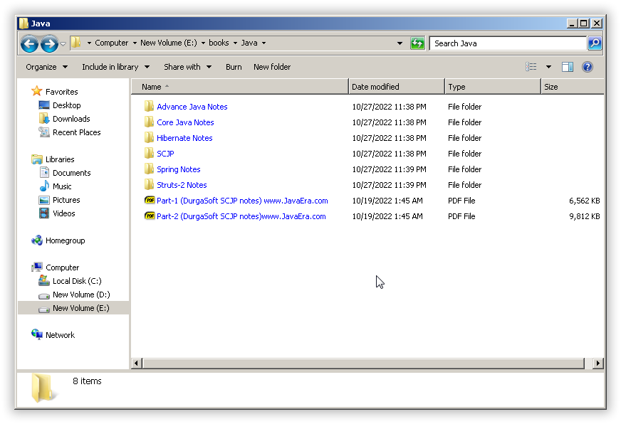{: .mx-auto.d-block :}

The size of files is around 135MB,

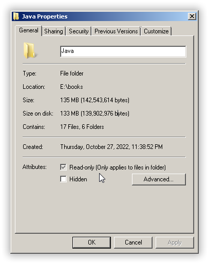{: .mx-auto.d-block :}

1. Convert the entire directory into a tar file. 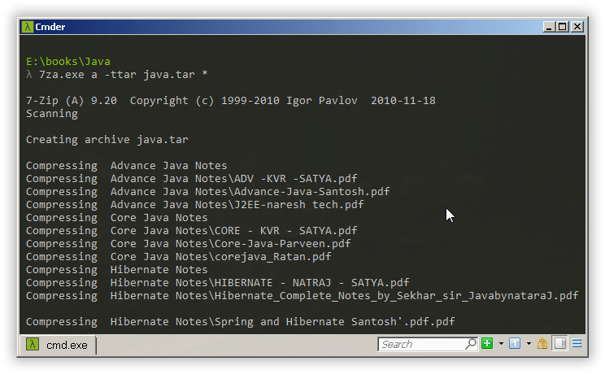{: .mx-auto.d-block :} The size of tar archive  will be approx. equal to the size of directory. 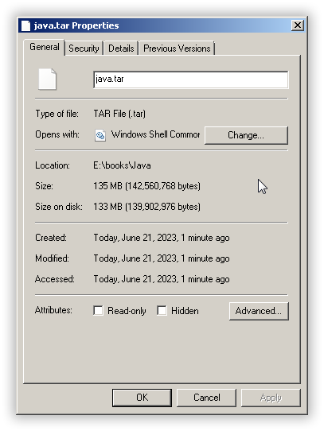{: .mx-auto.d-block :}
2. Use [precomp](http://schnaader.info/precomp.php). 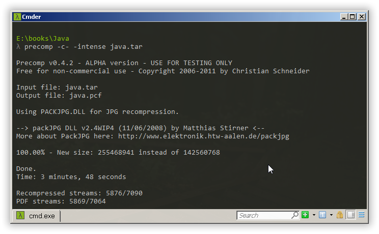{: .mx-auto.d-block :} The size of precomp archive will be double the tar size. Larger the precomp archive size better the compression ratio. 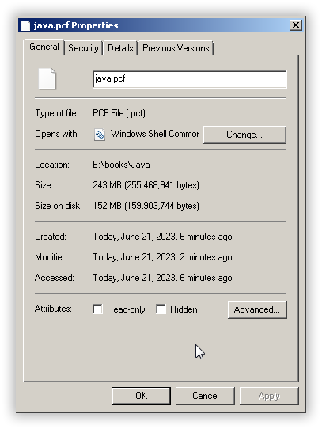{: .mx-auto.d-block :}
3. Use [super rep](https://www.softpedia.com/get/Compression-tools/SuperREP.shtml). 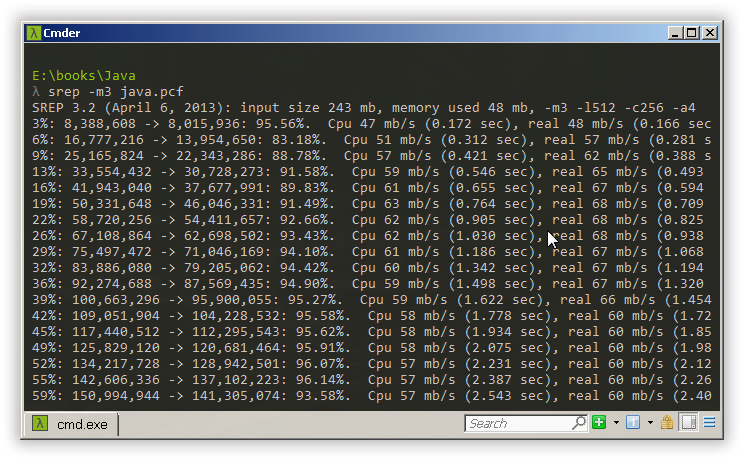{: .mx-auto.d-block :} The srep will compress the precomp archive. 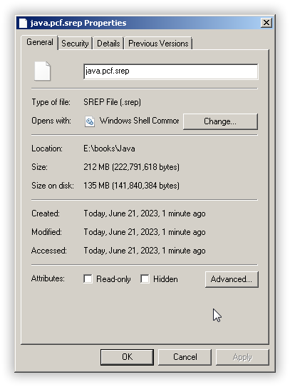{: .mx-auto.d-block :}
4. Use [nanozip](https://archive.org/download/nanozip.net). 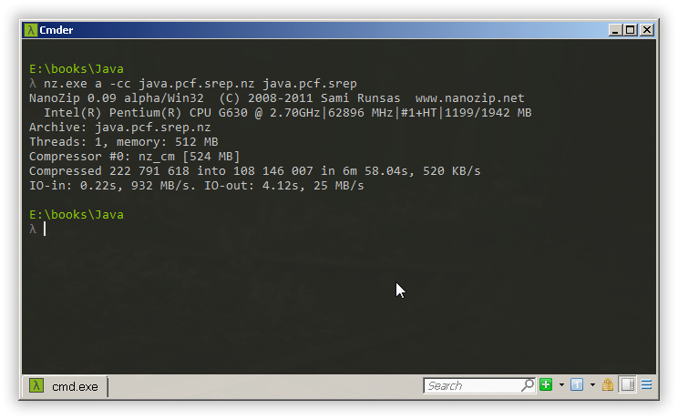{: .mx-auto.d-block :} Nanozip will strip the file size to 103MB. 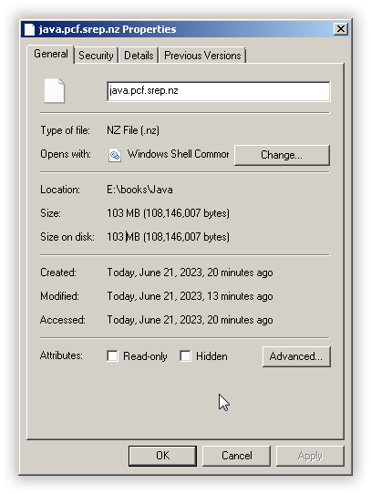{: .mx-auto.d-block :} To decompress carry out the process in reverse order.

Some of you might say 7zip is more than enough for compression. Yes, you are right [7zip](https://www.7-zip.org/) can be simple to use instead of my compression method. But 7zip was able to compress my directory to only 115MB, Still there is a 12MB difference!

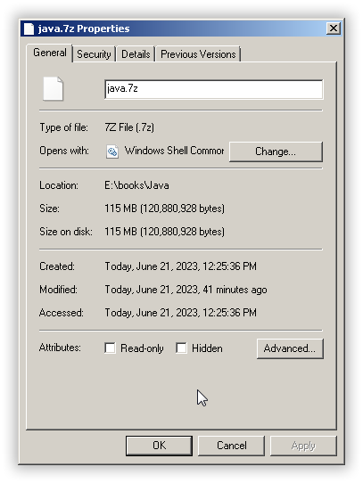{: .mx-auto.d-block :}

> Do not misunderstand. This is not the power of your creation! - Nanozip to 7zip.