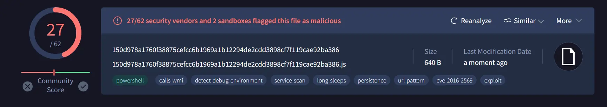
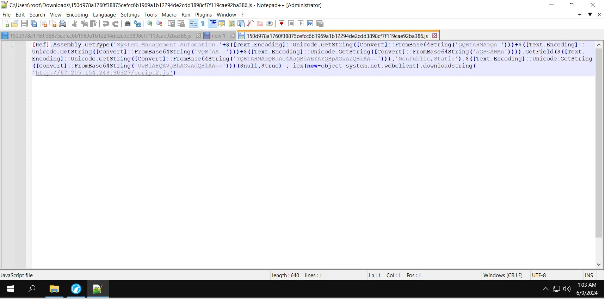
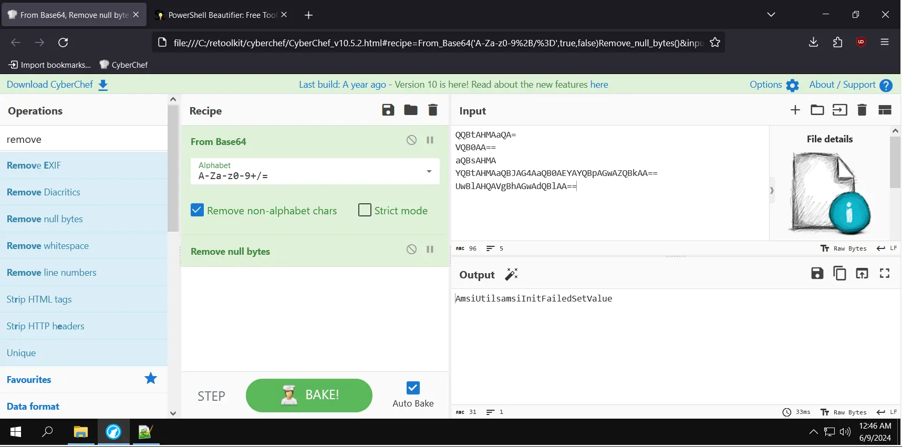
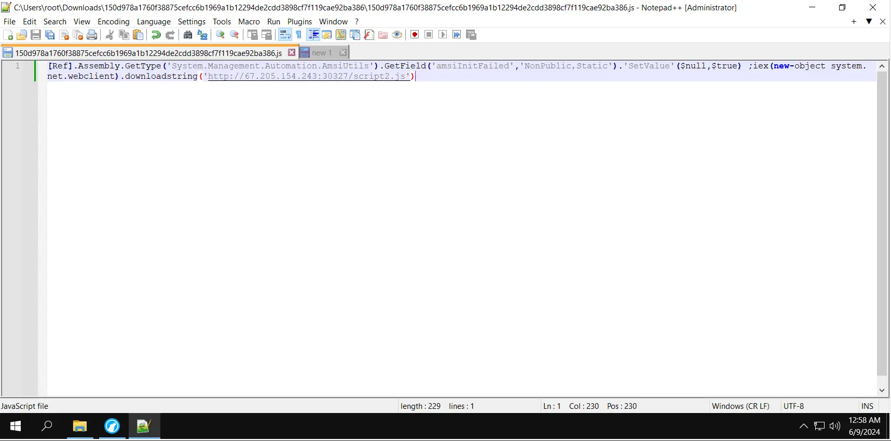
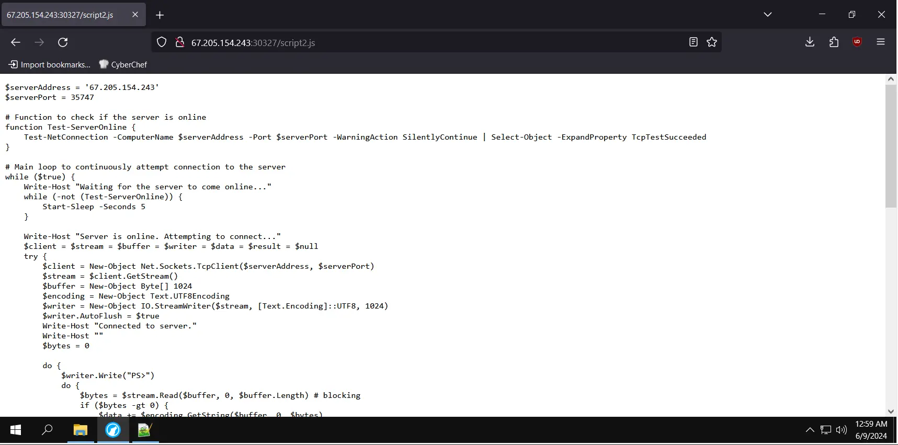

In this post, we will do malware analysis and reverse engineering on a powershell script that disables antivirus and then execute a reverse shell script.

The sample was downloaded from [Malware Bazaar](https://bazaar.abuse.ch/sample/150d978a1760f38875cefcc6b1969a1b12294de2cdd3898cf7f119cae92ba386/). 

Let's get the hash of the file first.

|Algorithm|Value|
|-|-|
|MD5|4665B3907AB5FC2903D954EB3C1F0FB6|
|SHA256|150D978A1760F38875CEFCC6B1969A1B12294DE2CDD3898CF7F119CAE92BA386|

Let's check what VirusTotal has!



The file has been detected by 27 antivirus programs as malicious.

The file opened in Notepad looks pretty compressed.



{: .box-note}
**NOTE**: The file extension has been spoofed, even if it is *.js*, but the syntax resembles PowerShell. This is known as file spoofing, de-coupling, or de-chaining.

We after using ours byakugan we got to see the strings encoded in base64. Also the strings are concataneted.


The base64 encoded strings are

```
QQBtAHMAaQA=
VQB0AA==
aQBsAHMA
YQBtAHMAaQBJAG4AaQB0AEYAYQBpAGwAZQBkAA==
UwBlAHQAVgBhAGwAdQBlAA==
```

The base64 decoded strings in cyberchef



{: .box-error}
**NOTE**: AMSI being encoded into base64 in a powershell script, there is always a RED flag.

The script might be disabling any active antivirus protection on the system.

After we replace the base64-encoded value with the decoded one, we get



The first part of the script disables active antivirus, and the second part downloads a script and executes it.



The second script also has a spoofed extension; even if it has a *.js* extension, it is actually a powershell script. The second script seems to be a reverse shell script.

Lets create a simple YARA rule for this sample
~~~
rule amsibypass
{
meta:
	author = "Mandar Naik"
	date = "2024-06-09"
	description = "Powershell Script to Bypass AMSI"
	hash0 = "4665b3907ab5fc2903d954eb3c1f0fb6"
	sample_filetype = "unknown"
strings:
	$string0 = "FromBase64String"
	$string1 = "downloadstring"
	$string2 = "System.Management.Automation"
condition:
	all of them
}
~~~