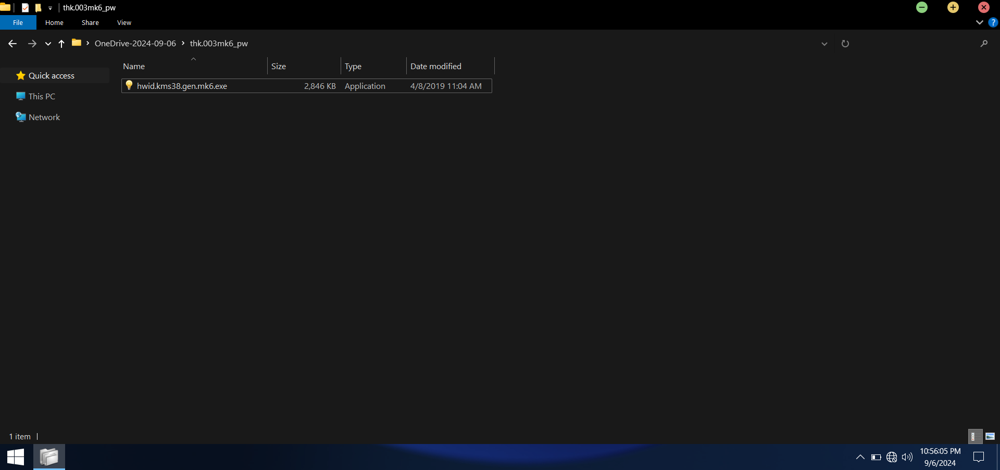
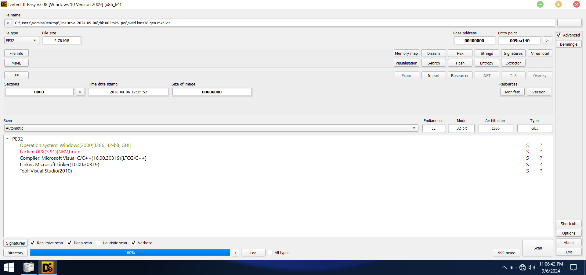
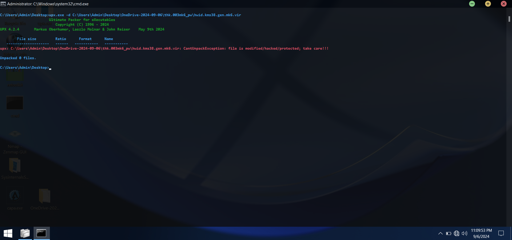
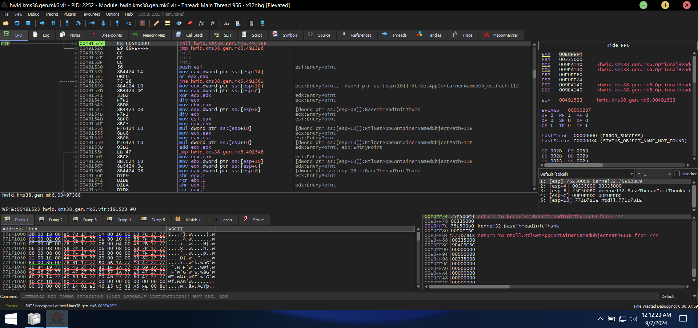
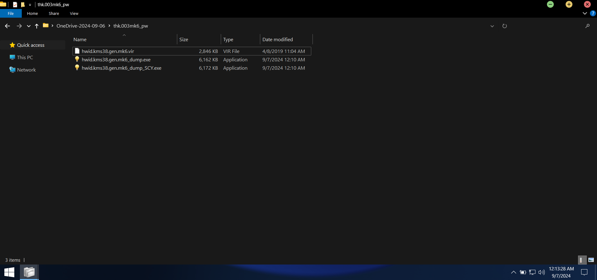
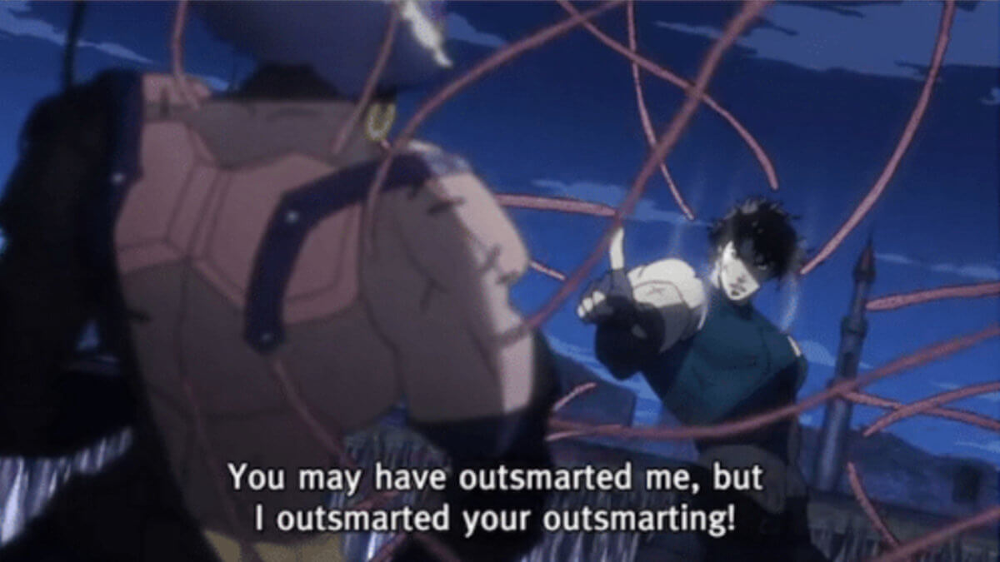
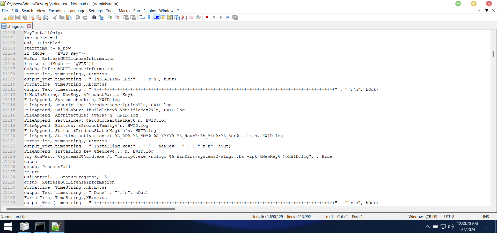
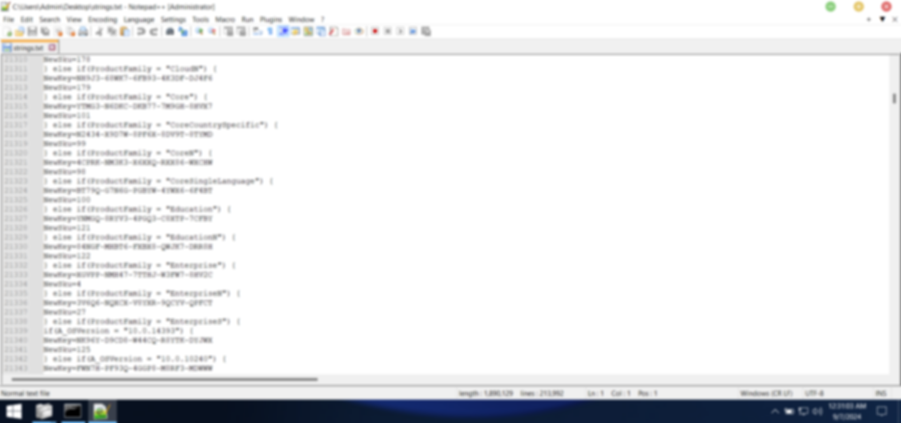
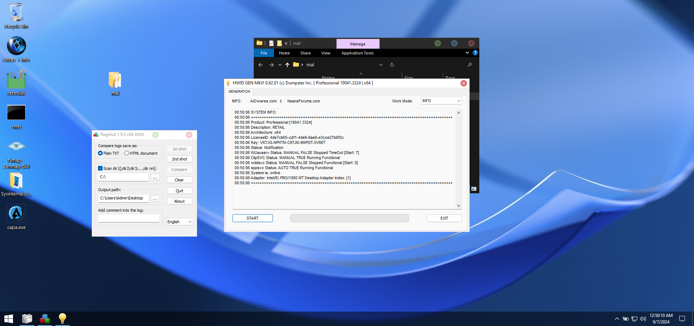

In this post, We will do malware analysis and reverse engineering on a KMS activator that is used to activate Microsoft Windows.

There are many activators available online, but we are choosing **hwid.kms38.gen.mk6.exe**, but other activators will usually exhibit the same behaviour.

The source of the sample is

~~~
hxxps[://]www[.]reddit[.]com/r/Piracy/comments/er3fon/very_quick_and_very_simple_guide_for_n00bs_trying/
hxxps[://]web[.]archive[.]org/web/20210328021007/hxxps[://]www[.]saidit[.]net/s/sjain_guides/comments/9p3/hwidkms38genmk6_download_and_usage_guide/
~~~

### Static Analysis

Let's get the hash of the file first.

~~~
MD5: de492cbc850eb7150ee62ea519b21986
SHA256: af333dbeab9268398d985eb80c74adfaa84210a7e6222ab3fc1684a73f052ff1
SHA512: b7976c507ab679bdf93e14139cc4cf4fbeb3629c06da345927c12263f6c393b6b99eccf3800c1bfd71cd5b8f687ba90ddb2cc9d94778164c560224b81352181e
~~~

Now we need to check the compiler or packer used to compile or protect the program; we can use _DIE_ for this.

The sample is compiled in C/C++, but it is packed using _UPX_. We can decompress the sample packed with UPX using the -d switch.

The adversary seems pretty smart; they modified the headers so that the sample cannot be decompressed. You can refer to [UPX-Modifier](https://github.com/mandarnaik016/UPX-Modifier) in case you need to disable the -d switch.

Let's use _x64dbg_ to dump the sample via entry point. For dumping the uncompressed sample via x64dbg, refer to [Infosecwriteups](https://infosecwriteups.com/how-to-unpack-upx-packed-malware-with-a-single-breakpoint-4d3a23e21332)

After locating the entry point, we dump the sample. PSSS: We also fixed the import table.

{: .box-note}
**NOTE**: We could have used _strings_ or _floss_ on the compressed sample, but that would fail to give the actual strings because they were packed by _upx_.

After using strings, we see some interesting results.

The second result has been blurred because it contains activations keys for microsoft products.

The blurred contains code that is used to check whether the OS is HOME/EDU/PRO, etc. Then, depending on the OS type, it injects respective keys.

### Dynamic Analysis

We tried dynamic analysis using _procmon_ and _regshot_ but didn't find anything interesting. The network log did not contain any connection to a remote server, which may be because the activation keys were hard-coded in the sample itself.

We meet next time dissecting another sample or comming up with an evasion technique until then **Bai Bai**