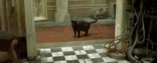

Hello! In this post, we'll conduct a complete malware analysis and reverse engineering of the [REMCOS RAT](https://www.malware-traffic-analysis.net/2026/08/06/index.html), along with tracing the attack chain.

It all began with an email containing links to the referenced files.





**MITRE ATT&CK Mapping** - Initial Access: T1566.002 (Phishing: Spearphishing Link)

The links redirect us to
```
hxxps[://]beeflex[.]online/documents/purchasing/invoice/PO-MQ22-141701[.]rar
```

The downloaded file "PO-MQ22-141701.rar" is a RAR file with a PDF and JS file.



We viewed the source code of the JavaScript file and found that it was obfuscated.



**MITRE ATT&CK Mapping** - Execution: T1059.007 (Command and Scripting Interpreter: JavaScript)

We de-obfuscate the file and analyze,

The source code contains var `test` with base64 blob and being called with method `run()`.





The decoded base64 contains an PowerShell script.

**MITRE ATT&CK Mapping** - Execution: T1059.001 (Command and Scripting Interpreter: PowerShell)



The `run` method initially checks if the payload exists, then base64-decodes the payload.



It then creates Windows ActiveX objects (For creating folders and files).



The method `getWorkingDirectory` creates the directory `C:\Temp\` in case it does not exists.



The `saveScriptFile` method saves the decoded Base64 data to the previously created `%TEMP%` folder under a randomly generated name.



The naming convention of the file being written is, 

```
ps_ + [12 random characters] + _ + [timestamp] + .ps1
```



The method `setupAutoStart` strips the file extension (ps1), provides a relative filename prefixed with _SystemUpdate\__, and adds an `lnk` extension (shortcut) within the startup directory.



Then configures the shortcut to execute using PowerShell, i.e.,
```
powershell.exe -ExecutionPolicy Bypass -WindowStyle Hidden -File <<PS1 FILE PATH>>.
```

Additionally, it creates the startup registry to execute the same script via PowerShell in the _HKCU_ and _HKLM_ hives.

**MITRE ATT&CK Mapping** - Persistence: T1547.001 (Boot or Logon Autostart Execution: Registry Run Keys / Startup Folder)

At last, the method `launchScript` launches the PowerShell script.



The above commands revolve around the execution of a **PowerShell script** that was saved in the `%TEMP%` folder, with the associated shortcut and registry keys modified for persistence.

We analyze (this PowerShell script),



The script contains data and keys in HEX format, converted to bytes and XORed, Then Invoked with the decrypted data.

We use CyberChef to get decrypted payload being invoked,



We get another PowerShell script.



Déjà vu



The function `Invoke-MonitoringLoop`,

XOR-ed the base64-encoded payload `$encodedPayload` with key `$keyPhrase` and stores in the variable `$decryptedContent`. 



The `$decryptedContent` contains another base64 blob.



The content are again base64 decoded and stored into `$binaryContent`. The decoded data is a binary file.



This binary is being launched via `aspnet_compiler.exe` with the params being another `$payloadBytes` in hex format.



The `$payloadBytes` contains another binary when decoded.



We end up with two binaries i.e.

Name: binaryContent.bin
SHA256: bb8d4061e70ab5c2c705d7b83a4e5131a2120e704da8dea7de2cf0b5f44ac75d

Name: payloadBytes.bin
SHA256: 806a36730c39b3991b23cf3108929b2a83955f7821f54a10b7c9ed653977c5e2

Thank you for being up to here. We will continue the analysis in the next part for the executables uncovered.

